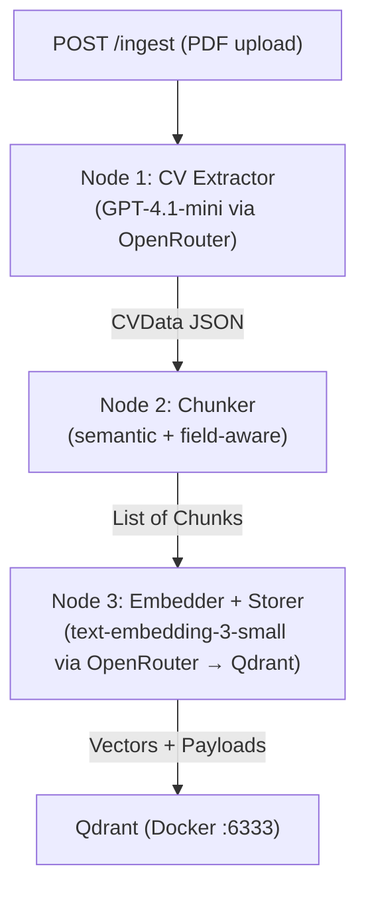
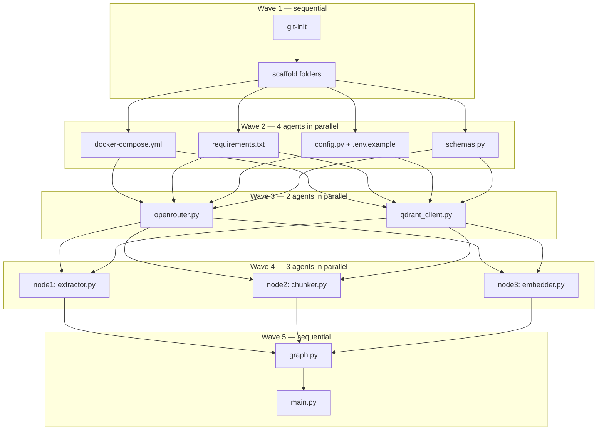

# HR RAG Data Pipeline — Implementation Plan

## Architecture Decision: FastAPI

**FastAPI** is chosen over Flask/Django for these reasons:
- Native async support (critical for LLM + embedding I/O-bound calls)
- Auto-generated OpenAPI docs (easy to test with Swagger UI)
- Pydantic models natively align with LangGraph's typed state
- Lighter than Django (no ORM/admin overhead needed here)

## High-Level Flow



## Project Structure

```
Rag/
├── app/
│   ├── main.py                  # FastAPI app, /ingest endpoint
│   ├── pipeline/
│   │   ├── graph.py             # LangGraph StateGraph definition
│   │   ├── state.py             # PipelineState (TypedDict)
│   │   ├── nodes/
│   │   │   ├── extractor.py     # Node 1: PDF → JSON
│   │   │   ├── chunker.py       # Node 2: JSON → Chunks
│   │   │   └── embedder.py      # Node 3: Chunks → Qdrant
│   │   └── schemas.py           # Pydantic models (CVData, Chunk, etc.)
│   ├── services/
│   │   ├── openrouter.py        # OpenRouter LLM client wrapper
│   │   └── qdrant_client.py     # Qdrant connection + upsert helpers
│   └── config.py                # Settings via pydantic-settings (.env)
├── docker-compose.yml           # Qdrant container
├── requirements.txt
├── .env.example                 # committed template (no secrets)
├── .env                         # ignored by git
└── .gitignore
```

## Node Details

### Node 1 — CV Extractor (`extractor.py`)
- **Input**: `raw_pdf_bytes: bytes`, `filename: str`
- **Process**:
  - Extract text from PDF using `pypdf`
  - Send to GPT-4.1-mini via OpenRouter with a structured prompt requesting JSON output
  - Prompt instructs: extract fields (name, email, phone, skills, experience, education, languages), translate everything to English, produce a `meta_summary` field
- **Output**: `cv_data: CVData` (Pydantic model / dict matching the JSON schema)

### Node 2 — Chunker (`chunker.py`)
- **Input**: `cv_data: CVData`
- **Process**:
  - Field-aware chunking: each section (experience entry, education entry, skills block) becomes its own chunk
  - Each chunk carries metadata: `candidate_id`, `section`, `original_filename`
  - Avoids naive character splitting — preserves semantic coherence per section
- **Output**: `chunks: List[Chunk]` where `Chunk = {text: str, metadata: dict}`

### Node 3 — Embedder + Storer (`embedder.py`)
- **Input**: `chunks: List[Chunk]`
- **Process**:
  - Batch-call `openai/text-embedding-3-small` (1536 dims) **via OpenRouter** (`https://openrouter.ai/api/v1/embeddings`) — same `OPENROUTER_API_KEY`, no local model, no direct OpenAI key needed
  - The `openai` SDK is reused here with `base_url="https://openrouter.ai/api/v1"` and `api_key=OPENROUTER_API_KEY`
  - Upsert to Qdrant collection `cv_candidates` with vectors + full metadata payload
  - Uses `candidate_id` (UUID generated at pipeline start) as point ID group
- **Output**: `stored_ids: List[str]` (Qdrant point IDs)

## LangGraph State (`state.py`)

```python
class PipelineState(TypedDict):
    raw_pdf_bytes: bytes
    filename: str
    candidate_id: str        # UUID, set before graph entry
    cv_data: dict            # output of Node 1
    chunks: list             # output of Node 2
    stored_ids: list         # output of Node 3
```

## LangGraph Graph (`graph.py`)

```python
graph = StateGraph(PipelineState)
graph.add_node("extract", extract_node)
graph.add_node("chunk",   chunk_node)
graph.add_node("embed",   embed_node)
graph.add_edge(START, "extract")
graph.add_edge("extract", "chunk")
graph.add_edge("chunk",   "embed")
graph.add_edge("embed",   END)
pipeline = graph.compile()
```

## Services

### `openrouter.py`
- Single shared async client for **all** remote AI calls — both LLM completions and embeddings
- Uses the `openai` SDK with `base_url="https://openrouter.ai/api/v1"` and `api_key=OPENROUTER_API_KEY`
- OpenRouter supports both endpoints under the same base URL:
  - `/chat/completions` → model `openai/gpt-4.1-mini` (Node 1)
  - `/embeddings` → model `openai/text-embedding-3-small` (Node 3)
- **No direct OpenAI API key is ever needed** — OpenRouter proxies everything

### `qdrant_client.py`
- Wraps `qdrant-client` Python SDK
- Auto-creates `cv_candidates` collection on startup if absent (1536 dims, cosine distance)

## Docker Compose (Qdrant)

```yaml
services:
  qdrant:
    image: qdrant/qdrant:latest
    ports:
      - "6333:6333"
    volumes:
      - qdrant_data:/qdrant/storage
volumes:
  qdrant_data:
```

## Key Dependencies (`requirements.txt`)

- `fastapi`, `uvicorn[standard]`
- `langgraph`
- `openai` (SDK reused for both LLM + embeddings, pointed at OpenRouter base URL)
- `pypdf` (PDF text extraction)
- `qdrant-client`
- `pydantic-settings`
- `python-multipart` (FastAPI file upload)
- `httpx`

## Execution Strategy

Sub-agents run in **parallel waves**. Within each wave all agents are independent and can run simultaneously. The next wave only starts after all agents in the current wave finish. Each wave ends with a single grouped git commit.



**Git commits per wave** — since parallel agents share the same repo, files are written by each agent but committed once per wave by the parent after all agents in that wave complete. This avoids concurrent commit conflicts.

| Wave | Agents | Commit message |
|------|--------|---------------|
| 1 | git-init, scaffold | `chore: init repo and project structure` |
| 2 | docker, deps, config, schemas | `chore: add infra files and core schemas` |
| 3 | openrouter-svc, qdrant-svc | `feat: add service clients (OpenRouter + Qdrant)` |
| 4 | node1, node2, node3 | `feat: add all three pipeline nodes` |
| 5 | graph, api | `feat: wire LangGraph graph and FastAPI endpoint` |

**13 agents → 5 waves** — significantly faster than pure sequential execution.

## Git Strategy

- `git init` runs first, before any files are created
- A `.gitignore` is committed that excludes `.env`, `__pycache__/`, `*.pyc`, and `qdrant_data/`
- `.env.example` (with placeholder values, no real secrets) is committed instead of `.env`
- **One commit per todo item** — each logical unit of work gets its own commit with a descriptive message, preserving a clean, reviewable history

Commit sequence will follow the todo order:
1. `chore: init repo with .gitignore and .env.example`
2. `chore: add docker-compose for Qdrant`
3. `chore: add requirements.txt`
4. `feat: add config.py with pydantic-settings`
5. `feat: add pipeline schemas (CVData, Chunk, PipelineState)`
6. `feat: add OpenRouter service client`
7. `feat: add Qdrant service client`
8. `feat: add Node 1 — CV extractor`
9. `feat: add Node 2 — chunker`
10. `feat: add Node 3 — embedder and Qdrant storer`
11. `feat: wire LangGraph pipeline graph`
12. `feat: add FastAPI /ingest endpoint`

## Environment Variables (`.env`)

```
OPENROUTER_API_KEY=...    # single key for ALL AI calls (LLM + embeddings)
QDRANT_HOST=localhost
QDRANT_PORT=6333
```
